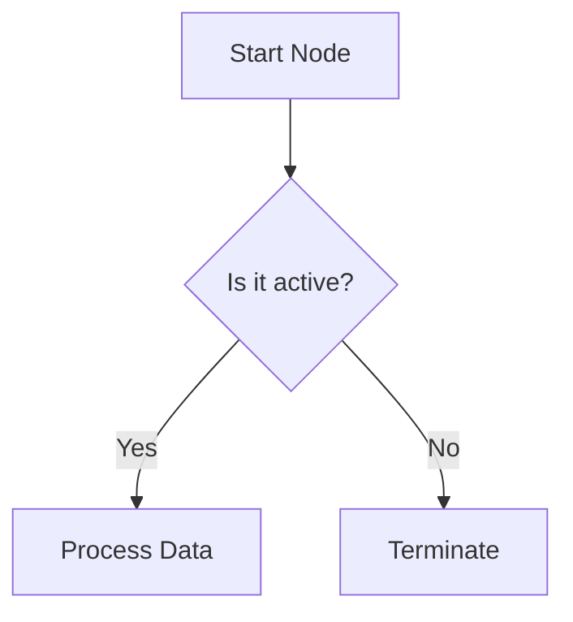
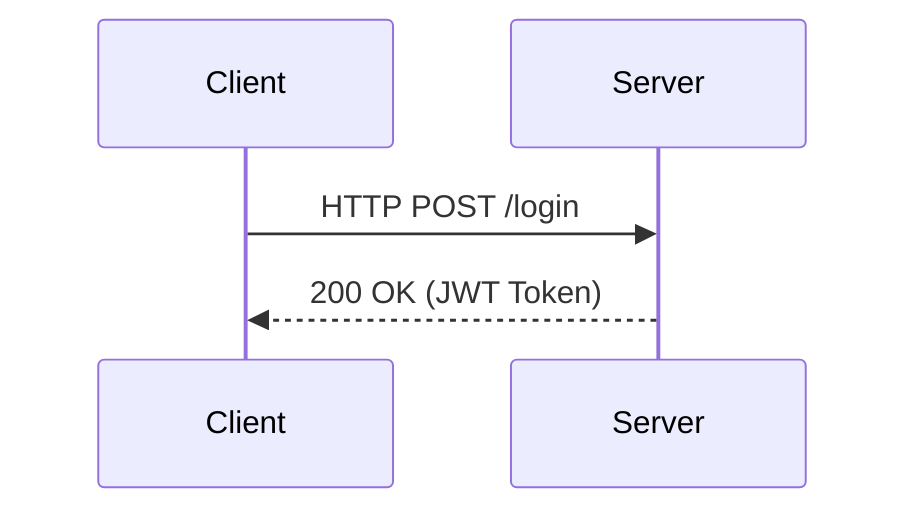

# Mermaid Studio — Local Diagram Editor

A premium, self-contained local web application designed to write, preview, and export high-quality Mermaid diagrams. Optimized for MAKAUT course note preparation (including diagrams, flowcharts, architectures, and value chains).

---

## 🚀 Key Features

* **Real-time Vector Rendering:** Instantly compiles and visualizes Mermaid syntax.
* **Unified Theme Styling:** Support for multiple design palettes (Dark, Light, Forest, Cool Neutral, and Sepia Paper). Toggling a theme switches the entire editor UI to matching colors, ensuring high diagram visibility.
* **Interactive Zoom & Pan Viewport:** Use your mouse wheel to zoom in and out, or drag to pan around complex diagrams inside a floating background frame.
* **Custom Filename Exports:** Enter a custom filename in the toolbar to save your diagrams directly as clean `.svg` files or high-resolution (`3x` print quality) `.png` images.
* **Completely Offline:** Runs locally in any web browser without server-side dependencies.

---

## 📂 Project Structure

```text
mermaid-editor/
├── index.html   # Main HTML layout
├── style.css    # Premium glassmorphic stylesheets & color themes
├── app.js       # Interactive zoom, pan, render, and export logic
└── README.md    # Reference documentation
```

---

## 🛠️ Setup and Usage

### Quick Start
You can launch the editor simply by double-clicking **`index.html`** to open it directly in any web browser.

> [!IMPORTANT]
> **Browser Same-Origin Security Restrictions**
> Modern browsers (Chrome, Edge, Firefox) impose security boundaries on pages running directly on the `file:///` protocol. 
> * **SVG Download:** Works 100% of the time under all protocols.
> * **PNG Download:** Rendering SVG vectors to a canvas for PNG download may trigger a security restriction on some browsers if the file is opened directly via `file://`.
>
> **Recommended Workaround:**
> For the full PNG download capability to work seamlessly, run a simple local web server from your workspace. For example:
> * **VS Code:** Install and use the **Live Server** extension.
> * **Python:** Run `python -m http.server 8000` inside this folder and open `http://localhost:8000`.
> * **Node.js:** Run `npx http-server` and open the local address.

---

## 💡 Mermaid Code Examples

Here are some typical structural formats you can copy and paste into the editor:

### Flowchart


### Sequence Diagram

